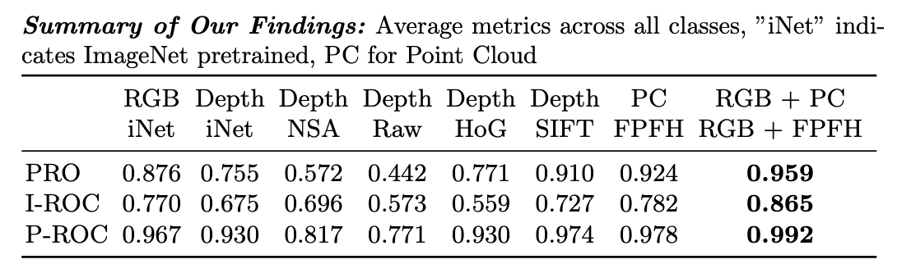
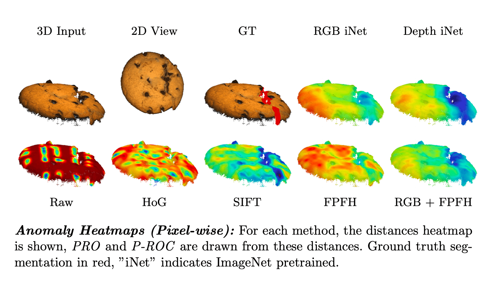

# An Empirical Investigation of 3D Anomaly Detection and Segmentation
### [Project](https://www.vision.huji.ac.il/3d_ads) | [Paper](https://arxiv.org/abs/2203.05550) <br>
[](https://paperswithcode.com/sota/3d-anomaly-detection-and-segmentation-on?p=an-empirical-investigation-of-3d-anomaly)

[](https://paperswithcode.com/sota/depth-anomaly-detection-and-segmentation-on?p=an-empirical-investigation-of-3d-anomaly)

[](https://paperswithcode.com/sota/rgb-3d-anomaly-detection-and-segmentation-on?p=an-empirical-investigation-of-3d-anomaly)

Official PyTorch Implementation for the "An Empirical Investigation of 3D Anomaly Detection and Segmentation" paper.  




___

> **An Empirical Investigation of 3D Anomaly Detection and Segmentation**<br>
> Eliahu Horwitz, Yedid Hoshen<br>
> https://arxiv.org/abs/2203.05550 <br>
>
>**Abstract:** Anomaly detection and segmentation (AD&S) in images has made tremendous progress in recent years while 3D information has often been ignored. 
> The objective of this paper is to further understand the benefit and role of 3D as apposed to color in image anomaly detection. 
> Our study begins by presenting a surprising finding: standard color-only anomaly segmentation methods, when applied to 3D datasets, significantly outperform all current methods.
> On the other hand, we observe that color-only methods are insufficient for images containing geometric anomalies where shape cannot be unambiguously inferred from 2D. 
> This suggests that better 3D methods are needed. We investigate different representations for 3D anomaly detection 
> and discover that hand-crafted orientation-invariant representations are unreasonably effective on this task. 
> We uncover a simple 3D-only method that outperforms all recent approaches while not using deep learning, external pretraining datasets or color information.
> As the 3D-only method cannot detect color and texture anomalies, we combine it with 2D color features, 
> granting us the best current results by a large margin (pixel ROCAUC: 99.2%, PRO: 95.9% on MVTec 3D-AD). 
> We conclude by discussing future challenges for 3D anomaly detection and segmentation.


## Getting Started

### Setup 
1.  Clone the repo:
```bash
git clone https://github.com/eliahuhorwitz/3D-ADS.git
cd 3D-ADS
```
2. Create a new environment and install the libraries:
```bash
python3.7 -m venv 3d_ads_venv
source 3d_ads_venv/bin/activate
pip install -r requirements.txt
```
3. Download and extract the dataset
```bash
mkdir datasets
cd datasets
mkdir mvtec3d
cd mvtec3d
wget https://www.mydrive.ch/shares/45920/dd1eb345346df066c63b5c95676b961b/download/428824485-1643285832/mvtec_3d_anomaly_detection.tar.xz
tar -xvf mvtec_3d_anomaly_detection.tar.xz 
```
<br>
<br>


### Training
We provide the implementations for 7 methods investigated in the paper. These are:
- RGB iNet
- Depth iNet
- Raw
- HoG
- SIFT
- FPFH
- RGB + FPFH

To run all methods on all 10 classes and save the PRO, Image ROCAUC, Pixel ROCAUC results to markdown tables run  
```bash
python3 main.py
```

To change which classes are used, see `mvtec3d_classes` located at `data/mvtec3d.py`. <br>
To change which methods are used, see the `PatchCore` constructor located at `patchcore_runner.py` and the `METHOD_NAMES` variable located at `main.py`.

**Note:** The results below are of the raw dataset, see the [preprocessing](https://github.com/eliahuhorwitz/3D-ADS#preprocessing) section for the preprocessing code and results (as seen in the paper). 
**Note:** The pixel-wise metrics benefit from preprocessing. As such, the unprocessed results are slightly below the ones reported in the paper.  


#### AU PRO Results

| Method     |   Bagel |   Cable<br>Gland |   Carrot |   Cookie |   Dowel |   Foam |   Peach |   Potato |   Rope |   Tire |   Mean |
|:-----------|--------:|--------------:|---------:|---------:|--------:|-------:|--------:|---------:|-------:|-------:|-------:|
| RGB iNet   |   0.898 |   0.948 |   0.927 |   0.872 |   0.927 |   0.555 |   0.902 |   0.931 |   0.903 |   0.899 |   0.876 |
| Depth iNet |   0.701 |   0.544 |   0.791 |   0.835 |   0.531 |   0.100 |   0.800 |   0.549 |   0.827 |   0.185 |   0.586 |
| Raw        |   0.040 |   0.047 |   0.433 |   0.080 |   0.283 |   0.099 |   0.035 |   0.168 |   0.631 |   0.093 |   0.191 |
| HoG        |   0.518 |   0.609 |   0.857 |   0.342 |   0.667 |   0.340 |   0.476 |   0.893 |   0.700 |   0.739 |   0.614 |
| SIFT       |   0.894 |   0.722 |   0.963 |   0.871 |   0.926 |   0.613 |   0.870 |   0.973 |   0.958 |   0.873 |   0.866 |
| FPFH       |   0.972 |   0.849 |   **0.981** |   0.939 |   0.963 |   0.693 |   0.975 |   **0.981** |   **0.980** |   0.949 |   0.928 |
| RGB + FPFH |   **0.976** |   **0.967** |   0.979 |   **0.974** |   **0.971** |   **0.884** |   **0.976** |   **0.981** |   0.959 |   **0.971** |   **0.964** |


#### Image ROCAUC Results

| Method     |   Bagel |   Cable<br>Gland |   Carrot |   Cookie |   Dowel |   Foam |   Peach |   Potato |   Rope |   Tire |   Mean |
|:-----------|--------:|--------------:|---------:|---------:|--------:|-------:|--------:|---------:|-------:|-------:|-------:|
| RGB iNet   |   0.854 |   **0.840** |   0.824 |   0.687 |   **0.974** |   0.716 |    0.713 |   0.593 |   0.920 |   0.724 |   0.785 |
| Depth iNet |   0.624 |   0.683 |   0.676 |   0.838 |   0.608 |   0.558 |    0.567 |   0.496 |   0.699 |   0.619 |   0.637 |
| Raw        |   0.578 |   0.732 |   0.444 |   0.798 |   0.579 |   0.537 |    0.347 |   0.306 |   0.439 |   0.517 |   0.528 |
| HoG        |   0.560 |   0.615 |   0.676 |   0.491 |   0.598 |   0.489 |    0.542 |   0.553 |   0.655 |   0.423 |   0.560 |
| SIFT       |   0.696 |   0.553 |   0.824 |   0.696 |   0.795 |   **0.773** |    0.573 |   0.746 |   0.936 |   0.553 |   0.714 |
| FPFH       |   0.820 |   0.533 |   0.877 |   0.769 |   0.718 |   0.574 |    0.774 |   0.895 |   **0.990** |   0.582 |   0.753 |
| RGB + FPFH |   **0.938** |   0.765 |   **0.972** |   **0.888** |   0.960 |   0.664 |    **0.904** |   **0.929** |   0.982 |   **0.726** |   **0.873** |


#### Pixel ROCAUC Results 

| Method     |   Bagel |   Cable<br>Gland |   Carrot |   Cookie |   Dowel |   Foam |   Peach |   Potato |   Rope |   Tire |   Mean |
|:-----------|--------:|--------------:|---------:|---------:|--------:|-------:|--------:|---------:|-------:|-------:|-------:|
| RGB iNet   |   0.983 |   0.984 |   0.980 |   0.974 |   0.985 |   0.836 |   0.976 |   0.982 |   0.989 |   0.975 |   0.966 |
| Depth iNet |   0.941 |   0.759 |   0.933 |   0.946 |   0.829 |   0.518 |   0.939 |   0.743 |   0.974 |   0.632 |   0.821 |
| Raw        |   0.404 |   0.306 |   0.772 |   0.457 |   0.641 |   0.478 |   0.354 |   0.602 |   0.905 |   0.558 |   0.548 |
| HoG        |   0.782 |   0.846 |   0.965 |   0.684 |   0.848 |   0.741 |   0.779 |   0.973 |   0.926 |   0.903 |   0.845 |
| SIFT       |   0.974 |   0.862 |   0.993 |   0.952 |   0.980 |   0.862 |   0.955 |   0.996 |   0.993 |   0.971 |   0.954 |
| FPFH       |   0.995 |   0.955 |   **0.998** |   0.971 |   0.993 |   0.911 |   0.995 |   **0.999** |   **0.998** |   0.988 |   0.980 |
| RGB + FPFH |   **0.996** |   **0.991** |   0.997 |   **0.995** |   **0.995** |   **0.972** |   **0.996** |   0.998 |   0.995 |   **0.994** |   **0.993** |
___

<br>
<br>


### Preprocessing
As mentioned in the paper, the results reported use the preprocessed dataset. <br>
While this preprocessing helps in cases where depth images are used, when using the point cloud the results are less pronounced. <br>
It may take a few hours to run the preprocessing. Results for the preprocessed dataset are reported below. <br>

To run the preprocessing 
```bash
python3 utils/preprocessing.py datasets/mvtec3d/
```

**Note:** the preprocessing is performed inplace (i.e. overriding the original dataset)

#### Preprocessed AU PRO Results 

| Method     |   Bagel |   Cable<br>Gland |   Carrot |   Cookie |   Dowel |   Foam |   Peach |   Potato |   Rope |   Tire |   Mean |
|:-----------|--------:|--------------:|---------:|---------:|--------:|-------:|--------:|---------:|-------:|-------:|-------:|
| RGB iNet   |   0.902 |   0.948 |   0.929 |   0.873 |   0.891 |   0.570 |   0.903 |   0.933 |  0.909 |  0.905 |  0.876 |
| Depth iNet |   0.763 |   0.676 |   0.884 |   0.883 |   0.864 |   0.322 |   0.881 |   0.840 |  0.844 |  0.634 |  0.759 |
| Raw        |   0.402 |   0.314 |   0.639 |   0.498 |   0.251 |   0.259 |   0.527 |   0.531 |  0.808 |  0.215 |  0.444 |
| HoG        |   0.712 |   0.761 |   0.932 |   0.487 |   0.833 |   0.520 |   0.743 |   0.949 |  0.916 |  0.858 |  0.771 |
| SIFT       |   0.944 |   0.845 |   0.975 |   0.894 |   0.909 |   0.733 |   0.946 |   0.981 |  0.953 |  0.928 |  0.911 |
| FPFH       |   0.974 |   0.878 |   **0.982** |   0.908 |   0.892 |   0.730 |   **0.977** |   **0.982** |  **0.956** |  0.962 |  0.924 |
| RGB + FPFH |   **0.976** |   **0.968** |   0.979 |   **0.972** |   **0.932** |   **0.884** |   0.975 |   0.981 |  0.950 |  **0.972** |  **0.959** |


#### Preprocessed Image ROCAUC Results 

| Method     |   Bagel |   Cable<br>Gland |   Carrot |   Cookie |   Dowel |   Foam |   Peach |   Potato |   Rope |   Tire |   Mean |
|:-----------|--------:|--------------:|---------:|---------:|--------:|-------:|--------:|---------:|-------:|-------:|-------:|
| RGB iNet   |   0.875 |   **0.880** |   0.777 |   0.705 |   **0.938** |   **0.720** |   0.718 |   0.615 |  0.859 |  0.681 |  0.777 |
| Depth iNet |   0.690 |   0.597 |   0.753 |   0.862 |   0.881 |   0.590 |   0.597 |   0.598 |  0.791 |  0.577 |  0.694 |
| Raw        |   0.627 |   0.507 |   0.600 |   0.654 |   0.573 |   0.524 |   0.532 |   0.612 |  0.412 |  0.678 |  0.572 |
| HoG        |   0.487 |   0.587 |   0.691 |   0.545 |   0.643 |   0.596 |   0.516 |   0.584 |  0.507 |  0.430 |  0.559 |
| SIFT       |   0.722 |   0.640 |   0.892 |   0.762 |   0.829 |   0.678 |   0.623 |   0.754 |  0.767 |  0.603 |  0.727 |
| FPFH       |   0.825 |   0.534 |   0.952 |   0.783 |   0.883 |   0.581 |   0.758 |   0.889 |  **0.929** |  0.656 |  0.779 |
| RGB + FPFH |   **0.923** |   0.770 |   **0.967** |   **0.905** |   0.928 |   0.657 |   **0.913** |   **0.915** |  0.921 |  **0.881** |  **0.878** |


#### Preprocessed Pixel ROCAUC Results

| Method     |   Bagel |   Cable<br>Gland |   Carrot |   Cookie |   Dowel |   Foam |   Peach |   Potato |   Rope |   Tire |   Mean |
|:-----------|--------:|--------------:|---------:|---------:|--------:|-------:|--------:|---------:|-------:|-------:|-------:|
| RGB iNet   |   0.983 |   0.984 |   0.98  |   0.974 |   0.973 |  0.851 |   0.976 |   0.983 |  0.987 |  0.977 |  0.967 |
| Depth iNet |   0.957 |   0.901 |   0.966 |   0.970 |   0.967 |  0.771 |   0.971 |   0.949 |  0.977 |  0.891 |  0.932 |
| Raw        |   0.803 |   0.750 |   0.849 |   0.801 |   0.610 |  0.696 |   0.830 |   0.772 |  0.951 |  0.670 |  0.773 |
| HoG        |   0.911 |   0.933 |   0.985 |   0.823 |   0.936 |  0.862 |   0.923 |   0.987 |  0.980 |  0.955 |  0.930 |
| SIFT       |   0.986 |   0.957 |   0.996 |   0.952 |   0.967 |  0.921 |   0.986 |   0.998 |  0.994 |  0.983 |  0.974 |
| FPFH       |   0.995 |   0.965 |   **0.999** |   0.947 |   0.966 |  0.928 |   **0.996** |   **0.999** |  **0.996** |  0.991 |  0.978 |
| RGB + FPFH |   **0.996** |   **0.992** |   0.997 |   **0.994** |   **0.981** |  **0.973** |   **0.996** |   0.998 |  0.994 |  **0.995** |  **0.992** |

___

<br>
<br>


## Citation
If you find this repository useful for your research, please use the following.

```
@misc{2203.05550,
Author = {Eliahu Horwitz and Yedid Hoshen},
Title = {An Empirical Investigation of 3D Anomaly Detection and Segmentation},
Year = {2022},
Eprint = {arXiv:2203.05550},
```


## Acknowledgments
- This work was supported in part by Oracle Cloud credits and related resources provided by the Oracle for Research program. [https://www.oracle.com/research](https://www.oracle.com/research)
 - The SIFT implementation is based on [Kornia](https://github.com/kornia/kornia)
 - The PatchCore logic is based on [https://github.com/rvorias/ind_knn_ad](https://github.com/rvorias/ind_knn_ad)
